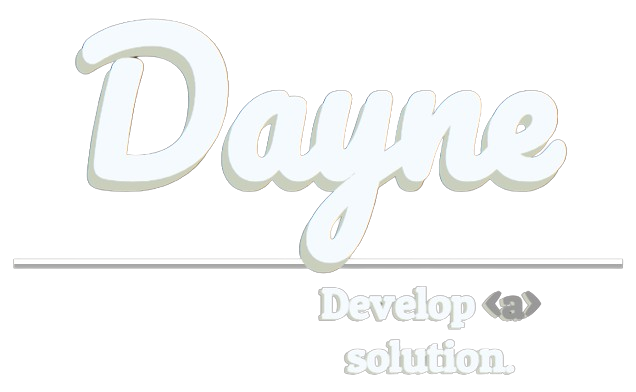

# React Portfolio

### **[Primary Deployment](https://daylo-portfolio.herokuapp.com/)** | **[My Domain](https://www.daylo.dev/)**

## Table of Contents
1. [Description](#description)
2. [Features](#features)
3. [Questions](#questions)

### Description

My portfolio was made with [Create React App](https://github.com/facebook/create-react-app). It is deployed via [Heroku App](https://www.heroku.com/). Preview it on my deployed links above. This application is flexible for mobile devices. Let me know if you see any bugs. I will continue to update it to improve it's existing features.

### Features
The details within my portfolio are designed to add a subtle, minimalistic personality, which closely resembles my own. I enjoyed manually styling without a **CSS** templating library, thanks to the use of [Chrome Dev Tools](https://developer.chrome.com/docs/devtools). You will notice a [React Intersection Observer](https://www.npmjs.com/package/react-intersection-observer) on the homepage. The code is designed to maintain simplicity and flexibility.

### Questions
Let me answer your questions. Contact me directly via [LinkedIn](https://www.linkedin.com/in/dayne-lalmond/). For additional information, you may use the form provided in my portfolio. Thanks for previewing my work.

